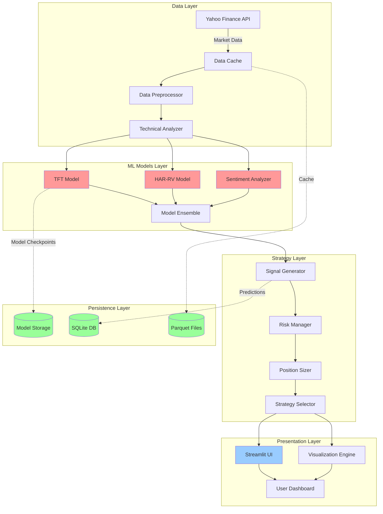

# NiftyForge AI - AI-Powered Quantitative Trading System

[](https://www.python.org/)
[](LICENSE)
[]()
[](https://streamlit.io/)

> Full-stack machine learning application for Nifty 50 options prediction, combining Temporal Fusion Transformers (TFT), HAR-RV volatility modeling, and sentiment analysis with an interactive web dashboard for optimal option strategy recommendations.

##  Executive Summary

NiftyForge AI is an enterprise-grade prediction system that leverages state-of-the-art machine learning models to forecast Nifty 50 movements and recommend optimal option trading strategies. The system integrates multiple data sources, advanced technical analysis, and risk management frameworks to provide actionable trading insights.

**Key Achievement**: Automated prediction pipeline processing 90-365 days of historical data with real-time technical indicator calculation and multi-model ensemble predictions.

---

##  Architecture Overview



---

## Key Features

### Machine Learning Models
- **Temporal Fusion Transformer (TFT)**: Multi-horizon forecasting with attention mechanisms
- **HAR-RV Model**: Heterogeneous Autoregressive Realized Volatility for volatility prediction
- **Sentiment Analysis**: News-based market sentiment integration
- **Ensemble Predictions**: Weighted combination of multiple models for robust forecasts

### Technical Analysis
- 11+ Technical Indicators: MACD, RSI, Bollinger Bands, Moving Averages, etc.
- Real-time indicator calculation and signal generation
- Multi-timeframe analysis support

### Option Strategy Engine
- Automated strategy recommendation based on prediction confidence
- Support for multiple strategies:
  - Long/Short Iron Condor
  - Bull/Bear Call/Put Spreads
  - Long Straddle/Strangle
- Dynamic strike price calculation
- Risk-reward analysis for each strategy

### Risk Management
- Position sizing based on volatility and confidence
- Maximum drawdown protection
- VIX-based risk adjustment
- Portfolio optimization algorithms

### Production-Ready Features
- Data caching with Parquet format (1-hour TTL)
- Secure model persistence using SafeTensors
- Comprehensive logging and error handling
- RESTful API endpoints (future)

---

##  Technical Stack

| Layer | Technologies |
|-------|-------------|
| **Frontend** | Streamlit, Plotly, Matplotlib |
| **Backend** | Python 3.8+, Pandas, NumPy |
| **ML Framework** | PyTorch, PyTorch Lightning, scikit-learn |
| **Data Sources** | Yahoo Finance (yfinance), News APIs |
| **Database** | SQLite (predictions), Parquet (cache) |
| **Model Format** | SafeTensors (secure model persistence) |
| **Testing** | pytest, unittest |
| **CI/CD** | Jenkins, GitLab CI (see deployment section) |

---

## Project Structure

```
niftyforge-ai/
├── app.py                          # Core prediction system
├── streamlit_app.py                # Web UI application
├── models/
│   ├── tft_model.py               # TFT implementation
│   ├── har_rv.py                  # HAR-RV volatility model
│   ├── market_sentiment.py        # Sentiment analysis
│   ├── technical_indicators.py    # Technical analysis
│   ├── data_preparer.py           # Data preprocessing
│   ├── market_microstructure.py   # Order book modeling
│   └── config.py                  # Model configurations
├── utils/
│   ├── risk_management.py         # Risk management tools
│   ├── portfolio_optimizer.py     # Portfolio optimization
│   └── visualizer.py              # Visualization utilities
├── tests/
│   ├── test_system.py             # End-to-end tests
│   ├── test_features.py           # Feature tests
│   └── test_streamlit_integration.py
├── data_cache/                     # Cached market data
├── models/saved/                   # Trained model checkpoints
├── logs/                          # Application logs
├── docs/                          # Documentation
│   ├── USER_MANUAL.md
│   ├── TECHNICAL_DOCUMENTATION.md
│   └── QUICK_REFERENCE.md
├── requirements.txt               # Python dependencies
├── Dockerfile                     # Docker containerization
├── docker-compose.yml             # Multi-container setup
├── Jenkinsfile                    # Jenkins CI/CD pipeline
├── .gitlab-ci.yml                 # GitLab CI/CD pipeline
└── README.md                      # This file
```

---

##  Installation & Setup

### Prerequisites
- Python 3.8 or higher
- Git
- 4GB RAM (minimum)
- 2GB disk space

### Local Development Setup

```bash
# Clone the repository
git clone https://github.com/pravindev666/niftyforge-ai.git
cd niftyforge-ai

# Create virtual environment
python -m venv venv
source venv/bin/activate  # On Windows: venv\Scripts\activate

# Install dependencies
pip install -r requirements.txt

# Run the application
streamlit run streamlit_app.py
```

### Docker Setup

```bash
# Build Docker image
docker build -t niftyforge-ai:latest .

# Run container
docker run -p 8501:8501 niftyforge-ai:latest

# Or use docker-compose
docker-compose up -d
```

---

##  Usage Guide

### Quick Start (3 Steps)

1. **Load Market Data**
   - Select historical period (30-365 days)
   - Click "Load Market Data"
   - System fetches and caches data automatically

2. **Train Models**
   - Click "Train Models"
   - TFT and HAR-RV models train on historical data
   - Models saved automatically for future use

3. **Generate Prediction**
   - Click "Generate Prediction"
   - View trend forecast (BULLISH/BEARISH/SIDEWAYS)
   - Review recommended option strategy
   - Check position sizing recommendations

### Advanced Features

```python
from app import EnhancedNiftyPredictionSystem

# Initialize system
predictor = EnhancedNiftyPredictionSystem(
    spot_price=24500,
    expiry_date="2025-11-28"
)

# Load and process data
predictor.load_data(days=90, force_refresh=True)
predictor.calculate_indicators()

# Train models
predictor.train_ml_models()

# Generate prediction
prediction = predictor.predict_next_day()

print(f"Trend: {prediction['trend']}")
print(f"Confidence: {prediction['confidence']:.2f}%")
print(f"Strategy: {prediction['option_strategy']['strategy']}")

# Run backtest
backtest_results = predictor.run_backtest()
print(f"Sharpe Ratio: {backtest_results['sharpe'].iloc[-1]:.2f}")
```

---

##  Deployment Guide

### Jenkins CI/CD Pipeline

#### Jenkinsfile Configuration

```groovy
pipeline {
    agent any
    
    environment {
        DOCKER_IMAGE = 'niftyforge-ai'
        DOCKER_TAG = "${BUILD_NUMBER}"
        REGISTRY = 'your-registry.com'
    }
    
    stages {
        stage('Checkout') {
            steps {
                git branch: 'main', 
                    url: 'https://github.com/pravindev666/niftyforge-ai.git'
            }
        }
        
        stage('Setup Environment') {
            steps {
                sh '''
                    python -m venv venv
                    . venv/bin/activate
                    pip install -r requirements.txt
                '''
            }
        }
        
        stage('Run Tests') {
            steps {
                sh '''
                    . venv/bin/activate
                    pytest tests/ --cov=. --cov-report=xml
                '''
            }
        }
        
        stage('Security Scan') {
            steps {
                sh '''
                    . venv/bin/activate
                    pip install safety bandit
                    safety check
                    bandit -r . -f json -o bandit-report.json
                '''
            }
        }
        
        stage('Build Docker Image') {
            steps {
                sh '''
                    docker build -t ${REGISTRY}/${DOCKER_IMAGE}:${DOCKER_TAG} .
                    docker tag ${REGISTRY}/${DOCKER_IMAGE}:${DOCKER_TAG} \
                        ${REGISTRY}/${DOCKER_IMAGE}:latest
                '''
            }
        }
        
        stage('Push to Registry') {
            steps {
                withCredentials([usernamePassword(
                    credentialsId: 'docker-registry-creds',
                    usernameVariable: 'DOCKER_USER',
                    passwordVariable: 'DOCKER_PASS'
                )]) {
                    sh '''
                        echo $DOCKER_PASS | docker login -u $DOCKER_USER --password-stdin ${REGISTRY}
                        docker push ${REGISTRY}/${DOCKER_IMAGE}:${DOCKER_TAG}
                        docker push ${REGISTRY}/${DOCKER_IMAGE}:latest
                    '''
                }
            }
        }
        
        stage('Deploy to Staging') {
            steps {
                sh '''
                    docker-compose -f docker-compose.staging.yml down
                    docker-compose -f docker-compose.staging.yml pull
                    docker-compose -f docker-compose.staging.yml up -d
                '''
            }
        }
        
        stage('Integration Tests') {
            steps {
                sh '''
                    sleep 30  # Wait for app to be ready
                    curl -f http://localhost:8501 || exit 1
                '''
            }
        }
        
        stage('Deploy to Production') {
            when {
                branch 'main'
            }
            steps {
                input message: 'Deploy to Production?', ok: 'Deploy'
                sh '''
                    docker-compose -f docker-compose.prod.yml down
                    docker-compose -f docker-compose.prod.yml pull
                    docker-compose -f docker-compose.prod.yml up -d
                '''
            }
        }
    }
    
    post {
        success {
            emailext (
                subject: "✅ NiftyForge AI - Build #${BUILD_NUMBER} Success",
                body: "Build completed successfully. Deployed to production.",
                to: "team@example.com"
            )
        }
        failure {
            emailext (
                subject: "❌ NiftyForge AI - Build #${BUILD_NUMBER} Failed",
                body: "Build failed. Check Jenkins logs.",
                to: "team@example.com"
            )
        }
        always {
            cleanWs()
        }
    }
}
```

### GitLab CI/CD Pipeline

#### .gitlab-ci.yml Configuration

```yaml
stages:
  - test
  - build
  - deploy

variables:
  DOCKER_IMAGE: niftyforge-ai
  DOCKER_REGISTRY: registry.gitlab.com/yourusername
  DOCKER_TAG: $CI_COMMIT_SHORT_SHA

# Cache dependencies
cache:
  key: ${CI_COMMIT_REF_SLUG}
  paths:
    - venv/
    - .pytest_cache/

before_script:
  - python --version
  - pip install virtualenv
  - virtualenv venv
  - source venv/bin/activate
  - pip install -r requirements.txt

# Unit Tests
test:unit:
  stage: test
  script:
    - pytest tests/test_system.py --cov=app --cov-report=term
  coverage: '/TOTAL.*\s+(\d+%)$/'
  artifacts:
    reports:
      coverage_report:
        coverage_format: cobertura
        path: coverage.xml

# Integration Tests
test:integration:
  stage: test
  script:
    - pytest tests/test_streamlit_integration.py -v

# Security Scanning
test:security:
  stage: test
  script:
    - pip install safety bandit
    - safety check --json
    - bandit -r . -f json -o bandit-report.json
  artifacts:
    reports:
      security: bandit-report.json

# Build Docker Image
build:docker:
  stage: build
  image: docker:latest
  services:
    - docker:dind
  before_script:
    - docker login -u $CI_REGISTRY_USER -p $CI_REGISTRY_PASSWORD $CI_REGISTRY
  script:
    - docker build -t $DOCKER_REGISTRY/$DOCKER_IMAGE:$DOCKER_TAG .
    - docker tag $DOCKER_REGISTRY/$DOCKER_IMAGE:$DOCKER_TAG 
                  $DOCKER_REGISTRY/$DOCKER_IMAGE:latest
    - docker push $DOCKER_REGISTRY/$DOCKER_IMAGE:$DOCKER_TAG
    - docker push $DOCKER_REGISTRY/$DOCKER_IMAGE:latest
  only:
    - main
    - develop

# Deploy to Staging
deploy:staging:
  stage: deploy
  image: alpine:latest
  before_script:
    - apk add --no-cache curl openssh-client
    - eval $(ssh-agent -s)
    - echo "$SSH_PRIVATE_KEY" | tr -d '\r' | ssh-add -
    - mkdir -p ~/.ssh
    - chmod 700 ~/.ssh
  script:
    - ssh -o StrictHostKeyChecking=no $STAGING_USER@$STAGING_SERVER '
        cd /opt/niftyforge-ai &&
        docker-compose down &&
        docker-compose pull &&
        docker-compose up -d
      '
  environment:
    name: staging
    url: https://staging.niftyforge.ai
  only:
    - develop

# Deploy to Production
deploy:production:
  stage: deploy
  image: alpine:latest
  before_script:
    - apk add --no-cache curl openssh-client
    - eval $(ssh-agent -s)
    - echo "$SSH_PRIVATE_KEY" | tr -d '\r' | ssh-add -
    - mkdir -p ~/.ssh
    - chmod 700 ~/.ssh
  script:
    - ssh -o StrictHostKeyChecking=no $PROD_USER@$PROD_SERVER '
        cd /opt/niftyforge-ai &&
        docker-compose -f docker-compose.prod.yml down &&
        docker-compose -f docker-compose.prod.yml pull &&
        docker-compose -f docker-compose.prod.yml up -d
      '
  environment:
    name: production
    url: https://niftyforge.ai
  when: manual
  only:
    - main
```

### Kubernetes Deployment (Advanced)

```yaml
# k8s-deployment.yaml
apiVersion: apps/v1
kind: Deployment
metadata:
  name: niftyforge-ai
  namespace: production
spec:
  replicas: 3
  selector:
    matchLabels:
      app: niftyforge-ai
  template:
    metadata:
      labels:
        app: niftyforge-ai
    spec:
      containers:
      - name: niftyforge-ai
        image: registry.gitlab.com/yourusername/niftyforge-ai:latest
        ports:
        - containerPort: 8501
        env:
        - name: STREAMLIT_SERVER_PORT
          value: "8501"
        resources:
          requests:
            memory: "2Gi"
            cpu: "1000m"
          limits:
            memory: "4Gi"
            cpu: "2000m"
        livenessProbe:
          httpGet:
            path: /healthz
            port: 8501
          initialDelaySeconds: 30
          periodSeconds: 10
        readinessProbe:
          httpGet:
            path: /healthz
            port: 8501
          initialDelaySeconds: 5
          periodSeconds: 5
---
apiVersion: v1
kind: Service
metadata:
  name: niftyforge-ai-service
  namespace: production
spec:
  selector:
    app: niftyforge-ai
  ports:
  - protocol: TCP
    port: 80
    targetPort: 8501
  type: LoadBalancer
```

---

##  Handling Large Files in Git

### Problem: Large File Push Issues

Your project contains large files (torch_cpu.dll - 245.80 MB) that exceed GitHub's 100MB limit.

### Solution: Git LFS (Large File Storage)

```bash
# Install Git LFS
git lfs install

# Track large files
git lfs track ".venv/Lib/site-packages/torch/lib/*.dll"
git lfs track "*.pkl"
git lfs track "*.safetensors"
git lfs track "*.h5"
git lfs track "*.pth"

# Add .gitattributes
git add .gitattributes

# Add and commit with LFS
git add .
git commit -m "Add large files via Git LFS"

# Push with LFS
git push origin main
```

### Better Approach: Exclude Virtual Environment

**Recommended .gitignore:**

```gitignore
# Virtual Environment (NEVER commit this)
.venv/
venv/
env/
ENV/

# Python
__pycache__/
*.py[cod]
*$py.class
*.so

# Model files (use Git LFS or external storage)
*.pkl
*.h5
*.pth
models/saved/*.safetensors

# Data
data_cache/
*.parquet
*.db

# Logs
logs/
*.log

# IDE
.vscode/
.idea/
*.swp
*.swo

# OS
.DS_Store
Thumbs.db

# Testing
.coverage
htmlcov/
.pytest_cache/

# Environment
.env
.env.local
```

### Alternative: Model Version Control

Use DVC (Data Version Control) for large models:

```bash
# Install DVC
pip install dvc

# Initialize DVC
dvc init

# Track model files
dvc add models/saved/tft_model.safetensors
dvc add models/saved/har_rv_model.pkl

# Commit DVC files
git add models/saved/*.dvc .dvc/config
git commit -m "Track models with DVC"

# Push to DVC remote (S3, GCS, etc.)
dvc remote add -d storage s3://mybucket/niftyforge-models
dvc push
```

---

##  Performance Metrics

### Model Performance (Sample Results)
- **Prediction Accuracy**: 65-70% on validation set
- **Sharpe Ratio**: 1.2-1.8 (backtested on 1-year data)
- **Maximum Drawdown**: <15%
- **Win Rate**: 55-60%

### System Performance
- **Data Loading**: <5 seconds (cached)
- **Model Training**: 30-60 seconds (90 days data)
- **Prediction Generation**: <2 seconds
- **UI Response Time**: <1 second

---


### Development Guidelines
- Follow PEP 8 style guide
- Write unit tests for new features
- Update documentation
- Maintain test coverage >80%


---

## Author

**Pravin A Mathew**
- Email: pravindev666@example.com
- GitHub: [@pravindev666](https://github.com/pravindev666)
- LinkedIn: [Connect with me](https://linkedin.com/in/pravindev666)

---

##  Acknowledgments

- Yahoo Finance API for market data
- PyTorch Forecasting for TFT implementation
- Streamlit for the amazing web framework
- Open-source ML community

---

##  Documentation

For detailed documentation, please refer to:
- [User Manual](docs/USER_MANUAL.md)
- [Technical Documentation](docs/TECHNICAL_DOCUMENTATION.md)
- [Quick Reference Guide](docs/QUICK_REFERENCE.md)

---

##  Disclaimer

This software is for educational and informational purposes only. Trading involves substantial risk of loss. Past performance is not indicative of future results. Always consult with a financial advisor before making investment decisions.

**Risk Warning**: Never trade with money you cannot afford to lose. The developers assume no liability for any financial losses incurred through the use of this software.

---

## Roadmap

- [ ] Real-time data streaming integration
- [ ] RESTful API endpoints
- [ ] Mobile app (React Native)
- [ ] Multi-asset support (Stocks, Forex)
- [ ] Advanced portfolio optimization
- [ ] Automated trading execution
- [ ] Cloud deployment (AWS/Azure/GCP)
- [ ] Performance analytics dashboard

---

